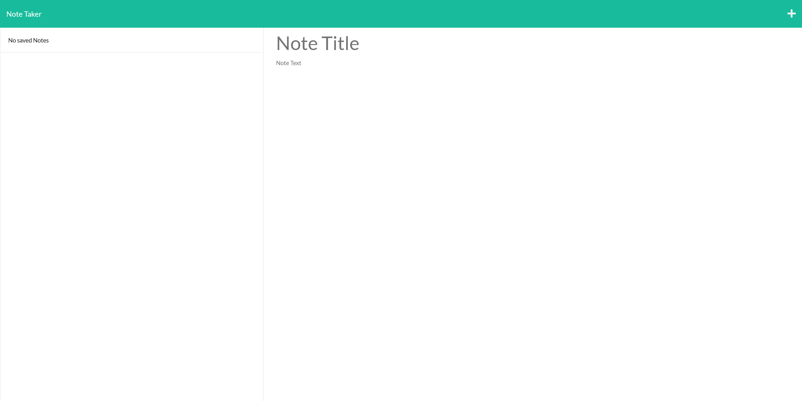

# 11-note-taker

## Description

This app allows the user to create notes and save them to a file that can be read later. This project was made to show my ability to use Express. During this project I learned how to
use the express node module to create a server that can handle get and post requests.

## Installation

To install this app, download the code from this repo and run the program from the terminal.
Run "npm i" before running the app to download and install all the necessary node modules. Then run "node server.js" in the /Develop/public/assests/js directory to run the app.

## Usage

To use this app you can install it or visit the live website. When using this app locally after installing, simply open a browser and set the address to localhost:PORT (port is whatever port is set by the process.env.port environment variable or port 3001 if no environment variable exists). Clicking the "Get Started" button will bring you to the note taking page where you can begin typing a note in the right column. Once you have typed in the note text area, a save icon will appear in the upper right of the page that you can use to save your note. Saved notes will appear in the left column and can be clicked on to bring them back to the right edit column. The "+" button will clear out the right column so you can write a new note.

Here is a link to the live site: 

Here is a screenshot of the app:
    

## License

MIT License

---